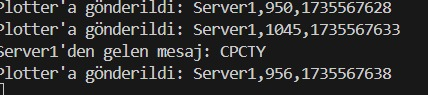
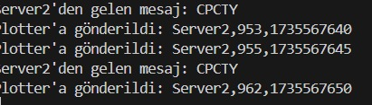
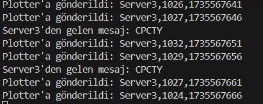
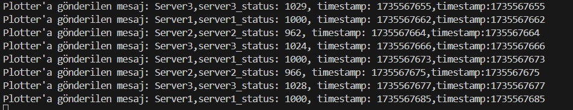
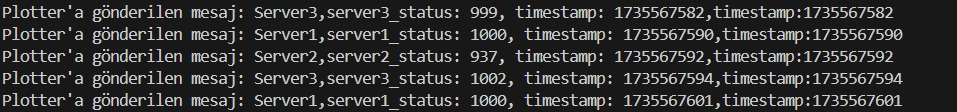
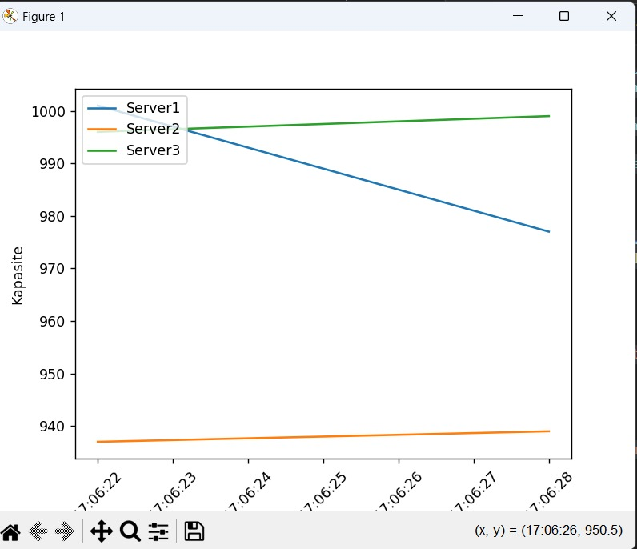

# Dist_SubsService

### Ekip üyeleri
22060396- Revas Akın
22060358- Merve Nur Türk

### Sunum Videosu Linki
https://youtu.be/-zYXgd0Uh3c

# Server1 Server2 ve Server3 hakkında
Server1.java server2.java server3.java
server1.java: 5000 numaralı port üzerinde istemci bağlantılarını dinler, diğer sunucularla (5001, 5002) bağlantı kurar.
server2.java: 5001 numaralı port üzerinde istemci bağlantılarını dinler, diğer sunucularla (5000, 5002) bağlantı kurar.
server3.java: 5002 numaralı port üzerinde istemci bağlantılarını dinler, diğer sunucularla (5000, 5001) bağlantı kurar.
Diğer sunucularla bağlantı kurar ve her 5 saniyede bir rastgele kapasite verisi üreterek  Plotter.py'e gönderir.
İstemci Mesajları: "STRT", "CPCTY" ve diğer talepleri işler, uygun cevaplar döner.
Plotter Gönderimi: Rastgele kapasite ve zaman damgasını düzenli aralıklarla 6000 portunda çalışan bir Plotter'a gönderir.

# Admin.rb ana İşlevler:

Bu Ruby programı, birden fazla Java sunucusunu başlatır, sunuculardan düzenli olarak kapasite bilgisi talep eder ve bu bilgileri Plotter.py'e iletir.

## Konfigürasyon Okuma: 
dist_subs.conf dosyasından fault_tolerance_level değeri okunur.
## Sunucu Başlatma: 
Server1, Server2, Server3 Java dosyaları çalıştırılır.
## Veri İşleme: 
Her 5 saniyede bir CPCTY talebiyle sunuculardan kapasite bilgisi alınır ve zaman damgasıyla birlikte Plotter'a gönderilir.
## Hata Yönetimi: 
Sunucuların ve Plotter'ın yanıt durumu kontrol edilip raporlanır.

# Plotter.py ana işlevler

## Veri Alma: 
Sunucu, localhost üzerinde 6000 portunda dinler ve gelen verileri kabul eder.
## Veri İşleme: 
Gelen veriler (Server1,1000,1735558428 gibi) ayrıştırılır, kapasite ve zaman damgası bilgileri çıkarılır.
## Grafik Çizimi: 
Her sunucunun kapasite bilgisi zaman damgalarına göre matplotlib kullanılarak çizilir ve grafik sürekli güncellenir.

## Hata Yönetimi: 
Geçersiz veri formatları için uyarı mesajları gösterilir.

Program, gerçek zamanlı olarak kapasite değişimlerini görselleştirir.

